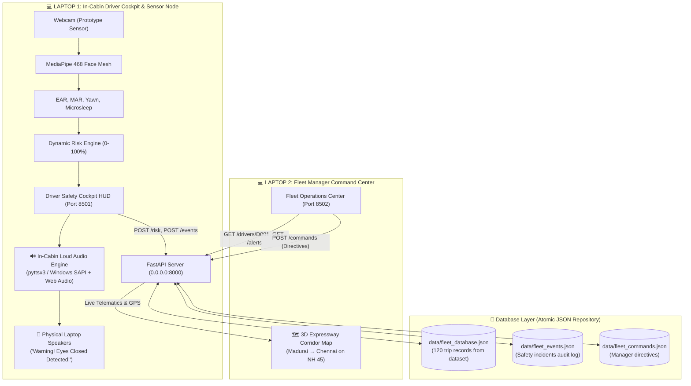

# 🛸 FleetSentinel // Anti-Gravity Fleet Management & Driver Safety OS

An enterprise-grade commercial fleet safety and real-time telematics platform featuring a **3-Layer Architecture** (Streamlit UI/UX, Atomic JSON Database, and FastAPI REST Backend) and distributed **multi-laptop cockpit/dispatcher deployment**.

---

## 🌟 System Architecture



---

## 🚀 Key Features

1. **Biometric Face Mesh Sensor (MediaPipe)**:
   - Tracks 468 3D facial landmarks via live laptop webcam.
   - Computes Eye Aspect Ratio (EAR) and Mouth Aspect Ratio (MAR).
   - Detects microsleep (> 2.0s eyes closed) and yawn clusters.
2. **🔊 Loud Aloud Laptop Speaker Warnings**:
   - Hardware-level voice speech directly through laptop physical speakers via Windows SAPI / `pyttsx3`.
   - Emergency audio alerts and dispatcher directives broadcast aloud into the cabin.
3. **Live 3D Expressway Corridor Map (Pydeck)**:
   - Real-time GPS vehicle tracking along the NH 45 Freight Corridor (Madurai &rarr; Chennai).
   - Dynamic marker switching between nominal green and critical pulsing red during fatigue episodes.
4. **FastAPI REST Telematics Backend**:
   - High-throughput asynchronous endpoints for risk ingestion, driver queries, and fleet health.
   - Interactive Swagger API docs at `/docs`.
5. **Zero-Corruption Atomic JSON Repository**:
   - Thread-safe persistence using atomic write-to-temp-then-replace semantics.
   - Comprehensive audit log of all safety alerts and supervisory interventions.

---

## 🛠️ Quick Start

### 1. Installation
```bash
git clone https://github.com/evangelin-sheeba/Fleet-Mind.git
cd Fleet-Mind
python -m venv .venv
.venv\Scripts\activate
pip install -r requirements.txt
```

### 2. Launch All Systems (Single Machine Mode)
Double-click `START_ALL_SYSTEMS.bat` or run:
```bash
# Terminal 1: FastAPI Backend
uvicorn app.main:app --host 0.0.0.0 --port 8000 --reload

# Terminal 2: Driver Cockpit (Webcam + In-Cabin Audio)
streamlit run driver_cockpit.py --server.port 8501 --server.address 0.0.0.0

# Terminal 3: Fleet Manager Command Center (3D Live Map)
streamlit run fleet_manager.py --server.port 8502 --server.address 0.0.0.0
```

### 3. Distributed 2-Laptop Setup
- **Laptop 1 (Driver Cabin & Sensor)**: Run `START_DRIVER_LAPTOP.bat`. Note the Wi-Fi IP address displayed (e.g. `10.58.253.174`).
- **Laptop 2 (Fleet Manager)**: Open browser and navigate to `http://<LAPTOP_1_IP>:8502`.

---

## 📡 API Endpoints Reference

| Method | Endpoint | Description |
| :--- | :--- | :--- |
| `GET` | `/health` | Server health check and database status |
| `GET` | `/drivers` | List all registered drivers with safety scores |
| `GET` | `/drivers/{driver_id}` | Detailed driver profile, route, and biometrics |
| `GET` | `/drivers/{driver_id}/risk` | Real-time dynamic risk breakdown (0-100%) |
| `GET` | `/vehicles` | List all fleet vehicles with status and coordinates |
| `GET` | `/vehicles/{vehicle_id}` | Detailed vehicle specifications and diagnostics |
| `GET` | `/alerts` | Chronological safety alerts and incident log |
| `POST` | `/events` | Ingest explicit safety event (microsleep, yawn, hard brake) |
| `POST` | `/risk` | Ingest continuous telemetry & biometrics from Driver Cockpit |
| `GET` | `/fleet/status` | Aggregated fleet operational overview |
| `POST` | `/commands` | Dispatch manager directive to driver cabin |
| `GET` | `/commands` | Retrieve recent manager directives |

---

## 📄 License
This project is licensed under the MIT License.
